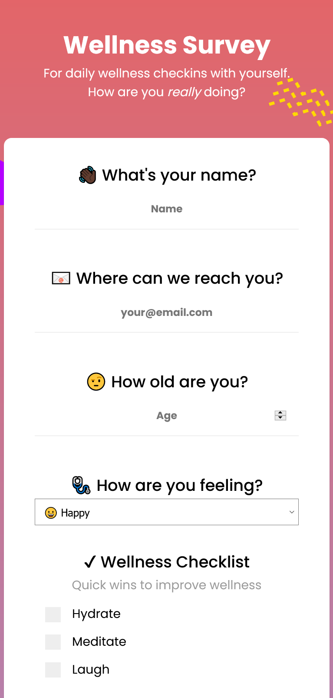

# Free Code Camp: Survey Form

## Objective
Build a CodePen.io app that is functionally similar to this: https://codepen.io/freeCodeCamp/full/VPaoNP

## User Stories

Toggle to view all

1. I can see a title with id="title" in H1 sized text.

2. I can see a short explanation with id="description" in P sized text.

3. I can see a form with id="survey-form".

4. Inside the form element, I am required to enter my name in a field with id="name".

5. Inside the form element, I am required to enter an email in a field with id="email".

6. If I enter an email that is not formatted correctly, I will see an HTML5 validation error.

7. Inside the form, I can enter a number in a field with id="number".

8.  If I enter non-numbers in the number input, I will see an HTML5 validation error.

9. If I enter numbers outside the range of the number input, which are defined by the min and max attributes, I will see an HTML5 validation error.

10. For the name, email, and number input fields inside the form I can see corresponding labels that describe the purpose of each field with the following ids: id="name-label", id="email-label", and id="number-label".

11. For the name, email, and number input fields, I can see placeholder text that gives me a description or instructions for each field.

12. Inside the form element, I can select an option from a dropdown that has a corresponding id="dropdown".

13. Inside the form element, I can select a field from one or more groups of radio buttons. Each group should be grouped using the name attribute.

14. Inside the form element, I can select several fields from a series of checkboxes, each of which must have a value attribute.

15. Inside the form element, I am presented with a textarea at the end for additional comments.

16. Inside the form element, I am presented with a button with id="submit" to submit all my inputs.

&nbsp; 

## Solution
 

### Links
- [Codepen](https://codepen.io/corvida/details/vYgGVWb)
- [Live Demo](https://shegeeks.github.io/FreeCodeCamp-Projects/Survey%20Form/index.html)
- [Source Files](https://github.com/SheGeeks/FreeCodeCamp-Projects/tree/main/Survey%20Form)

## Process

For this project, I created a responsive wellness survey form. This was built mobile-first using Semantic HTML5, CSS3, Flexbox and CSS Grid. I was able to reuse code from my Frontend Mentor sign-up form challenge solution to quickly get this survey off the ground. I was very happy with this because I'm trying to be mindful of creating code that can be reused quickly and easily when taking on these challenges.

The biggest effort made with this challenge was customizing the radio and checkmark boxes. This was not a requirement, but I wanted them to fit the form aesthetically. W3Schools came to the rescue (resource link below). Great practice using CSS selectors to apply minor styling differences to the indicators for both boxes.

Also, manually reviewed CSS in combination with Firefox Dev Tools to remove styles that were unnecessarily duplicating parent styles. While there are tools to do this, manually doing so helps me reinforce my understanding of how styles are applied in CSS and adjust accordingly to maintain clean code.

### Resources
- [W3Schools: Custom Checkboxes](https://www.w3schools.com/howto/howto_css_custom_checkbox.asp)

### Contact
- Website: SheGeeks.net
- Twitter: [@Corvida](https://www.twitter.com/corvida)

---

  
