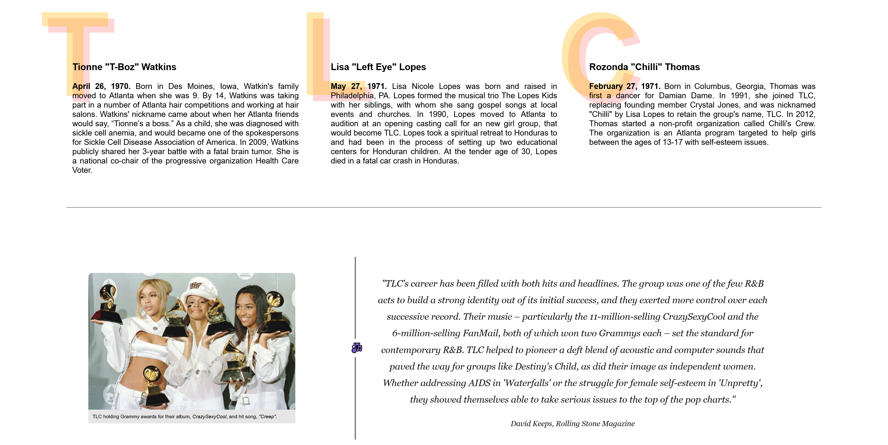
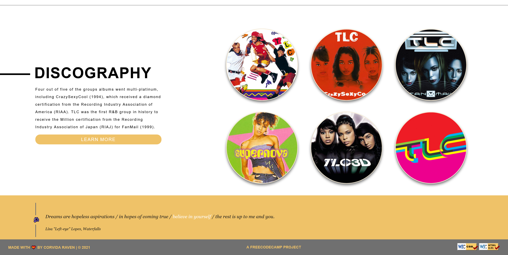

# FreeCodeCamp: Tribute Page

## Objective
Build a CodePen.io app that is functionally similar to this: https://codepen.io/freeCodeCamp/full/zNqgVx.

## User Stories

Toggle to view all

1. An element with a corresponding id="main", which contains all other elements.

2. An element with a corresponding id="title", which contains a string (i.e. text) that describes the subject of the tribute page (e.g. "Dr. Norman Borlaug").

3. A div element with a corresponding id="img-div".

4. Within the img-div element, there should be an img element with a corresponding id="image".

5. Within the img-div element, there should bean element with a corresponding id="img-caption" that contains textual content describing the image shown in img-div.

6. An element with a corresponding id="tribute-info", which contains textual content describing the subject of the tribute page.

7. An a element with a corresponding id="tribute-link", which links to an outside site that contains additional information about the subject of the tribute page. HINT: You must give your element an attribute of target and set it to _blank in order for your link to open in a new tab (i.e. target="_blank").

8. The img element should responsively resize, relative to the width of its parent element, without exceeding its original size.

9. The img element should be centered within its parent element.

## Solution

 

### Links
- [Live Demo](https://shegeeks.github.io/FreeCodeCamp-Projects/Tribute%20Page/index.html)
- [Codepen.io](https://codepen.io/corvida/details/ZEBNZMY)
- [Source Files](https://github.com/SheGeeks/FreeCodeCamp-Projects/tree/main/Tribute%20Page)

## Process
My tribute page pays homage to one of my favorite music bands and one of the bestselling groups of all-time: TLC. You'll find short bios on each member, media quotes, career stats and a chronological discography section of their albums (collective and solo releases). **HTML5, CSS3, CSS Grid.**

### Contact
- Website: SheGeeks.net
- Twitter: [@Corvida](https://www.twitter.com/corvida)

---

  
