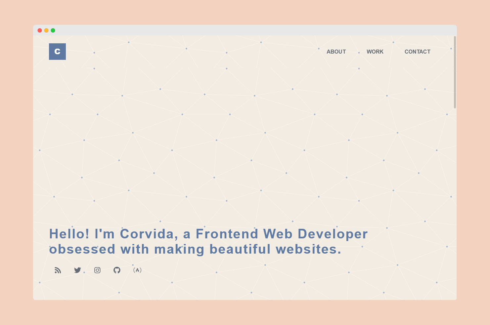

# FreeCodeCamp: Personal Porfolio

## Objective
Build a CodePen.io app that is functionally similar to this: https://codepen.io/freeCodeCamp/full/zNBOYG.

## User Stories

Toggle to view all

1. My portfolio should have a welcome section with an id of welcome-section.

2. The welcome section should have an h1 element that contains text.

3. My portfolio should have a projects section with an id of projects.

4. The projects section should contain at least one element with a class of project-tile to hold a project.

5. The projects section should contain at least one link to a project.

6. My portfolio should have a navbar with an id of navbar.

7. The navbar should contain at least one link that I can click on to navigate to different sections of the page.

8. My portfolio should have a link with an id of profile-link, which opens my GitHub or FCC profile in a new tab.

9. My portfolio should have at least one media query.

10. The height of the welcome section should be equal to the height of the viewport.

11. The navbar should always be at the top of the viewport.

 

## Solution 

### Links
- [CodePen](https://codepen.io/corvida/pen/rNymMMQ)
- [Site Demo](https://shegeeks.github.io/FreeCodeCamp-Projects/portfolio/index.html)
- [Source Code](https://github.com/SheGeeks/FreeCodeCamp-Projects/tree/main/portfolio)

## Process
This personal portfolio project was built **mobile-first, is A11Y friendly, and uses semantic HTML5, CSS3, Flexbox.**. 

I created a simple design that centers around the porfolio projects: the projects I've completed for [FreeCodeCamp's  Responsive Design course](https://freecodecamp.org). Each project include a brief description and links to a live demo akong with the source code. I had the most fun playing with the link and text colors to create a color scheme that was both accessible and pleasing to look at. 

This is my final project for the course. I'm planning to continue practicing with additional courses in the future. Stay tuned!

### Resources
- [Dummy Text](https://www.blindtextgenerator.com/lorem-ipsum)
- [FontAwesome Icons](https://fontawesome.com/)
- [SVG Background Generator](https://www.svgbackgrounds.com/#rainbow-vortex)
- [Skill Bar Tutorial](https://www.w3schools.com/howto/howto_css_skill_bar.asp)

### Contact
- Website: SheGeeks.net
- Twitter: [@Corvida](https://www.twitter.com/corvida)

---

  
