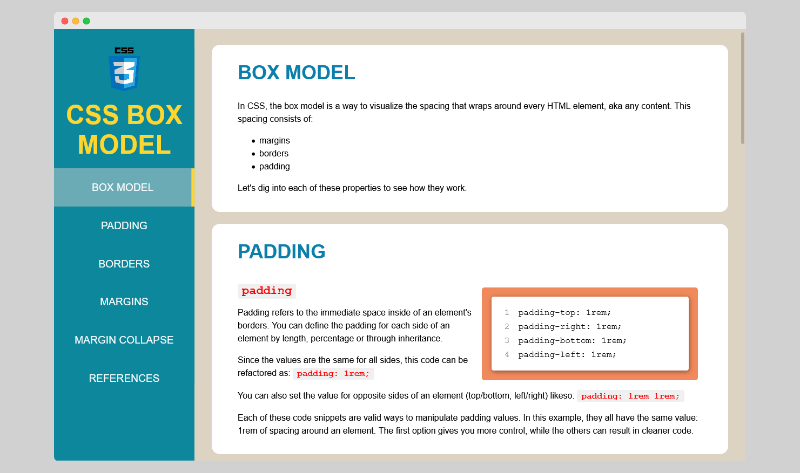

# FreeCodeCamp: Survey Form

## Objective
Build a CodePen.io app that is functionally similar to this: https://codepen.io/freeCodeCamp/full/VPaoNP

## User Stories

Toggle to view all

1. I can see a main element with a corresponding id="main-doc", which contains the page's main content (technical documentation).

2. Within the #main-doc element, I can see several section elements, each with a class of main-section. There should be a minimum of 5.

3. The first element within each .main-section should be a header element which contains text that describes the topic of that section.

4. Each section element with the class of main-section should also have an id that corresponds with the text of each header contained within it. Any spaces should be replaced with underscores (e.g. The section that contains the header "JavaScript and Java" should have a corresponding id="JavaScript_and_Java").

5. The .main-section elements should contain at least 10 p elements total (not each).

6. The .main-section elements should contain at least 5 code elements total (not each).

7. The .main-section elements should contain at least 5 li items total (not each).

8. The .main-section elements should contain at least 5 li items total (not each).

9. The navbar element should contain one header element which contains text that describes the topic of the technical documentation.

10. Additionally, the navbar should contain link (a) elements with the class of nav-link. There should be one for every element with the class main-section.

11. The header element in the navbar must come before any link (a) elements in the navbar.

12. Each element with the class of nav-link should contain text that corresponds to the header text within each section (e.g. if you have a "Hello world" section/header, your navbar should have an element which contains the text "Hello world").

13. When I click on a navbar element, the page should navigate to the corresponding section of the main-doc element (e.g. If I click on a nav-link element that contains the text "Hello world", the page navigates to a section element that has that id and contains the corresponding header.

14. On regular sized devices (laptops, desktops), the element with id="navbar" should be shown on the left side of the screen and should always be visible to the user.

15. My Technical Documentation page should use at least one media query.

 

## Solution 

### Links
- [CodePen](https://codepen.io/corvida/pen/abJJKJp)
- [Live Demo](https://shegeeks.github.io/FreeCodeCamp-Projects/tech-doc/index.html)
- [Source Files](https://github.com/SheGeeks/FreeCodeCamp-Projects/tree/main/tech-doc)

## Process
This technical document was built **mobile-first and uses semantic HTML5, CSS3, Flexbox**. This was a fun and relatively easy project to mockup. Writing the content took longer than the actual coding process. 

One thing I made an effort to not implement in this project are lines. This was inspired by an article from Erik Kennedy's [Learn UI Design newsletter](https://learnui.design/newsletter.html) where he breaks down ways to segment and divide layouts without using lines. Aside from the navigation marker for an active link, I was able to accomplish this and am pleased with how clean it turned out.

### Resources
- Listed under references section of project.

### Contact
- Website: SheGeeks.net
- Twitter: [@Corvida](https://www.twitter.com/corvida)

---

  
